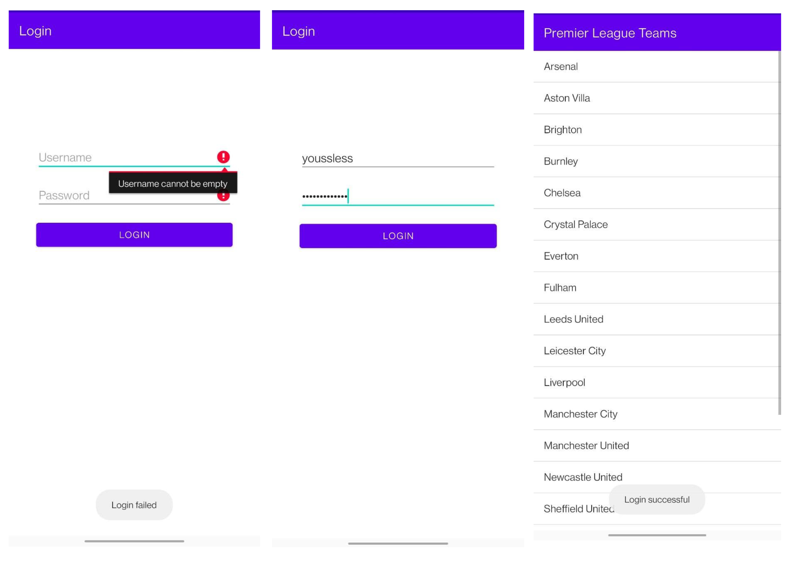

# Cognizant Android Technical Assignment
Name: Yaseen Lahmami

### Setup

JDK version 15

Create and add local.properties file in the root folder with the SDK file location
sdk.dir=C\:{path}\\AppData\\Local\\Android\\Sdk

Clean, exit the IDE and rebuild the project if this error occurs "Activity class {} does not exist"

### Explanation

- The login screen contains some input validation, the username and password fields cannot be empty otherwise the user cannot login
- Once logged in the user is able to see a list view of premier league teams
- The user is notified if there are any errors
- As an extra I would like to implement a backend to store users and the list view contents
